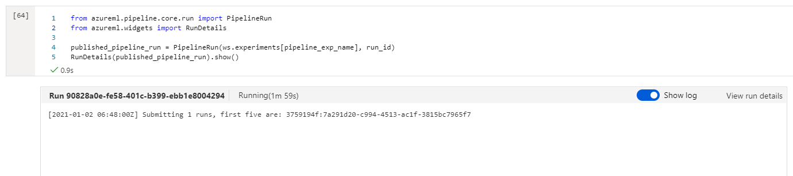
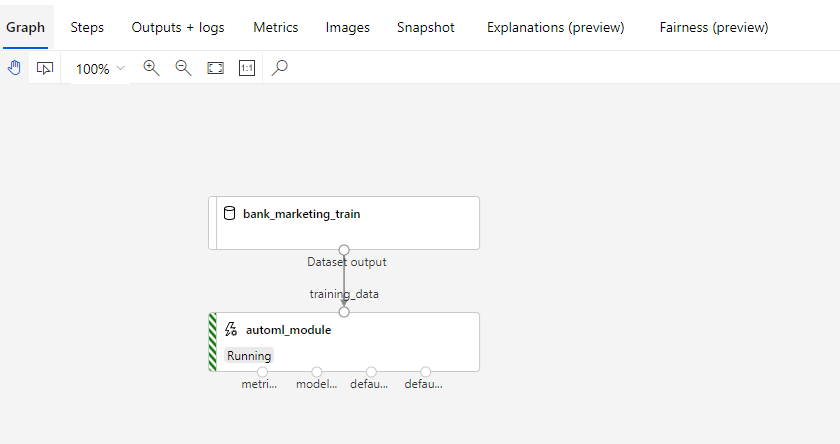

# Consuming AutoML model and Pipeline experiment runs via REST API endpoints

## Project Overview

Our objective is to leverage Azure’s Machine Learning (AML / ML) studio to train a cloud-based machine learning production model, deploy the model, and retrieve its REST endpoint for consumption. The training data is from a Portuguese banking institution and the ML goal is to predict if a client will subscribe to a term deposit following a marketing campaign. This, therefore, is a classification problem. Additionally, we will leverage Azure’s Python SDK to create, publish, and consume a pipeline to continuously execute future ML experiments for this task. The publish step of our pipeline also makes a REST endpoint / HTTP API available to us for consumption.
To execute on this workflow, we must first establish a user as the service principal / owner. This core action allows us to automate the entire training, publishing, and consumption of our ML pipelines. Next, we will use Azure’s Graphical User interface (GUI) to conduct an ML experiment by configuring Azure’s AutoML framework. Once these experiments are complete, we will retrieve the best model, deploy it to retrieve a REST endpoint that Azure provides, and later consume that model via its endpoint to score data. We will also perform load tests with Apache Bench simulating multiple POST requests to the endpoint. This helps us to benchmark our average response time to Azure’s 60 second benchmark and it allows to check our model endpoint’s health status. 
Lastly, we will re-submit our experiment using an Azure ML pipeline strategy. We will create, publish, and consume our pipeline also via a REST endpoint. We will leverage Azure’s Python SDK to execute the pipeline steps. This approach allows us to automate future pipeline deployments, via the pipeline’s REST endpoint, with a Python script. Authentication is also crucial to our pipeline automation.

## Architectural Diagram

**AutoML Model Consumption Architecture with AML GUI**  

**Pipeline Consumption Architecture with Azure Python SDK**  

## Key Steps

### Authentication

We need to first enable an Azure service principal with Azure’s CLI to automate our authentication process i.e., without requiring user interaction. This is especially useful in a continuous integration and deployment machine learning (ML) strategy for training experiments and scoring in production.

**Az login screenshot confirming account as owner**  

### Automated ML Experiment

We will register our bank marketing dataset using Azure’s GUI and execute an AutoML experiment also using the GUI.

**Registered Bank Marketing Dataset**  

**Completed AutoML Run**  

**Best model from our AutoML experiment**  

### Deploy the best model

In this step, we will deploy the best model (VotingEnsemble) and consume that model’s endpoint via an HTTP REST API.

**Endpoints section in Azure ML Studio, showing that “Application Insights enabled” says “true”. App Insights allow us to visually examine the health of our deployed endpoint.**  

### Enable logging

Logging is a necessary step in this process as it allows us to detect performance issues, or “anomalies”, with our deployed model and it shows us errors as they occur.

**Logging is enabled by running the provided logs.py script**  

### Swagger Documentation

Swagger allows for quick documentation of our model’s REST API. We are able to view the appropriate GET and POST endpoints as well as the expected data structure in JSON format.

**Swagger runs on localhost showing the HTTP API methods and responses for the model**  

### Consume model endpoints

Here we will consume the model via its POST endpoint

**endpoint.py script runs against the API producing JSON output from the model**  

**Apache Benchmark (ab) runs against the HTTP API using authentication keys to retrieve performance results. We ran 100 requests against our benchmark. Performance excels well beneath the 60 second mark at ~ 218ms per request.**  

### Create and publish a pipeline

We will re-submit our experiment using an Azure ML pipeline strategy. We will create, publish, and consume our pipeline via Azure’s Python SDK and a REST endpoint.

**The pipeline section of Azure ML studio, showing that the pipeline has been created**  

**The Bankmarketing dataset with the AutoML module**  

**The “Published Pipeline overview”, showing a REST endpoint and a status of ACTIVE**  

#### Configure a pipeline with the Python SDK

As part of our pipeline run we will run a RunDetails widget to show step runs with Azure’s Python SDK.

**A screenshot of the Jupyter Notebook is included showing the “Use RunDetails Widget” with the step runs**  

#### Use a REST endpoint to interact with the Pipeline

We will then re-submit the pipeline using the pipeline’s REST endpoint.

**ML studio showing the pipeline endpoint as Active**  

**ML studio showing the scheduled run**  

## Future Considerations

To improve our project in the future we will heavily focus on complete end-to-end automation by:

1. Adopting an infrastructure-as-code (IAC) tenet where training, continuous experimentation, and scoring are completely executed via code instead of using the Azure ML studio GUI.
2. We will 'wrap' our codes into functions and pipelines. So there will be three key pipelines, 

    * a pipeline for training,
    * experimentation, and
    * for scoring.
Instead of deploying a model endpoint, we will deploy a scoring pipeline that includes individual .py (python) scripts for retrieving, pre-processing, and serving data to the predictive model. This should more approximate our real-world experience with real-world data (RWD) since almost 80% of modeling and scoring is spent on pre-processing.

Our main goal is to eventually operationalize ML, for training and scoring, as a continuous integration / continuous delivery and delopyment (CI/CD) process. Automating our end-to-end ML workflow is a critical step to achieving this goal.

## Screen Recording
*TODO* Provide a link to a screen recording of the project in action. Remember that the screencast should demonstrate:

## Standout Suggestions

As stated, we performed load testing using Apache Bench. We simulated 100 calls using the JSON payload. Performance was excellent per the 60 second baseline at approximately 218ms per request.
